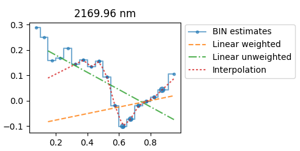

# 1. Single Image Mode

#### Coefficients for TOPO and BRDF correction only

```bash
python topo_brdf_coeffs_modify_hybeta4.py  --img /hyspiri/f130626t01p00r07_rfl_v1a_img_subset  --obs /hyspiri/f130626t01p00r07_obs_v1a_img_subset  --od /hyspiri/out_dir/  --pref f130626t01p00r07  --kernels sparse thick  --mask  --mask_threshold 0.3 0.7  --brdf  --topo
```

#### TOPO results only

```bash
python topo_brdf_coeffs_modify_hybeta4.py  --img /hyspiri/f130626t01p00r07_rfl_v1a_img_subset  --obs /hyspiri/f130626t01p00r07_obs_v1a_img_subset  --od /hyspiri/out_dir/  --pref f130626t01p00r07 --mask  --topo

python image_to_traits_modify_hybeta4.py -img /hyspiri/f130626t01p00r07_rfl_v1a_img_subset --obs /hyspiri/f130626t01p00r07_obs_v1a_img_subset -od /hyspiri/out_dir/ --mask --topo /hyspiri/out_dir/f130626t01p00r07_subset_topo_coeffs.json --out _topo
```

#### BRDF results only

```bash
python topo_brdf_coeffs_modify_hybeta4.py  --img /hyspiri/f130626t01p00r07_rfl_v1a_img_subset  --obs /hyspiri/f130626t01p00r07_obs_v1a_img_subset  --od /hyspiri/out_dir/  --pref f130626t01p00r07  --kernels sparse thick  --mask  --mask_threshold 0.3 0.7  --brdf

python image_to_traits_modify_hybeta4.py -img /hyspiri/f130626t01p00r07_rfl_v1a_img_subset --obs /hyspiri/f130626t01p00r07_obs_v1a_img_subset -od /hyspiri/out_dir/ --brdf /hyspiri/out_dir/f130626t01p00r07_subset --mask --mask_threshold .3 .7  --out _brdf
```

#### TOPO and BRDF result (ENVI format)

```bash
python topo_brdf_coeffs_modify_hybeta4.py  --img /hyspiri/f130626t01p00r07_rfl_v1a_img_subset  --obs /hyspiri/f130626t01p00r07_obs_v1a_img_subset  --od /hyspiri/out_dir/  --pref f130626t01p00r07  --kernels sparse thick  --mask  --mask_threshold 0.3 0.7  --brdf  --topo

python image_to_traits_modify_hybeta4.py -img /hyspiri/f130626t01p00r07_rfl_v1a_img_subset --obs /hyspiri/f130626t01p00r07_obs_v1a_img_subset -od /hyspiri/out_dir/ --topo /hyspiri/out_dir/f130626t01p00r07_subset_topo_coeffs.json --brdf /hyspiri/out_dir/f130626t01p00r07_subset --mask --mask_threshold .3 .7  --out _topo_brdf
```

#### TOPO and BRDF result (GeoTIFF format - 8 bands)

```bash
python topo_brdf_coeffs_modify_hybeta4.py  --img /hyspiri/f130626t01p00r07_rfl_v1a_img_subset  --obs /hyspiri/f130626t01p00r07_obs_v1a_img_subset  --od /hyspiri/out_dir/  --pref f130626t01p00r07  --kernels sparse thick  --mask  --mask_threshold 0.3 0.7  --brdf  --topo

python image_to_traits_modify_hybeta4.py -img /hyspiri/f130626t01p00r07_rfl_v1a_img_subset --obs /hyspiri/f130626t01p00r07_obs_v1a_img_subset -od /hyspiri/out_dir/ --topo /hyspiri/out_dir/f130626t01p00r07_subset_topo_coeffs.json --brdf /hyspiri/out_dir/f130626t01p00r07_subset --mask --mask_threshold .3 .7  --rgbim
```

#### TOPO and BRDF result (ENVI format plus GeoTIFF format - 8 bands)

```bash
python topo_brdf_coeffs_modify_hybeta4.py  --img /hyspiri/f130626t01p00r07_rfl_v1a_img_subset  --obs /hyspiri/f130626t01p00r07_obs_v1a_img_subset  --od /hyspiri/out_dir/  --pref f130626t01p00r07  --kernels sparse thick  --mask  --mask_threshold 0.3 0.7  --brdf  --topo

python image_to_traits_modify_hybeta4.py -img /hyspiri/f130626t01p00r07_rfl_v1a_img_subset --obs /hyspiri/f130626t01p00r07_obs_v1a_img_subset -od /hyspiri/out_dir/ --topo /hyspiri/out_dir/f130626t01p00r07_subset_topo_coeffs.json --brdf /hyspiri/out_dir/f130626t01p00r07_subset --mask --mask_threshold .3 .7  --out _topo_brdf --rgbim
```

#### Traits results (GeoTIFF format)

```bash
python topo_brdf_coeffs_modify_hybeta4.py  --img /hyspiri/f130626t01p00r07_rfl_v1a_img_subset  --obs /hyspiri/f130626t01p00r07_obs_v1a_img_subset  --od /hyspiri/out_dir/  --pref f130626t01p00r07  --kernels sparse thick  --mask  --mask_threshold 0.3 0.7  --brdf  --topo

python image_to_traits_modify_hybeta4.py -img /hyspiri/f130626t01p00r07_rfl_v1a_img_subset --obs /hyspiri/f130626t01p00r07_obs_v1a_img_subset -od /hyspiri/out_dir/ --brdf /hyspiri/out_dir/f130626t01p00r07  --topo /hyspiri/out_dir/f130626t01p00r07_subset_topo_coeffs.json  --mask --mask_threshold .3 .7  -coeffs /hyspiri/traits/
```

# 2. Batch Mode

Prepare the file list (`fake_list.txt`) and the shell script (`fake_batch.sh`).

<p></p>

**Directory for L2 reflectance image** `/hyspiri/`

**Directory for L1 obs_ort image** `/hyspiri/`

**Image List** `/hyspiri/fake_list.txt`

**Output directory** `/hyspiri/out_dir/`

**Directory for trait coefficients (json format)** `/hyspiri/traits/`

fake_list.txt

```
f130626t01p00r07
f130626t01p00r09
```

Shell script for traitss mapping (`fake_batch.sh`)


```shell
#echo $1 # rfl image dir
#echo $2 # obs file dir
#echo $3 #file list
#echo $4 # output dir
#echo $5 # coeffs dir 

while IFS= read -r imgbase
do

    imagename=$(ls $1/$imgbase*rfl* | head -1)
    obsname=$(ls $2/$imgbase*obs* | head -1)
    
    echo $imagename
    echo $obsname
    
    python topo_brdf_coeffs_modify_hybeta4.py  --img $imagename  --obs $obsname  --od $4  --pref $imgbase    --kernels sparse thick  --mask  --mask_threshold 0.3 0.7  --brdf --topo
    python image_to_traits_modify_hybeta4.py -img $imagename --obs $obsname -od $4 --mask --mask_threshold 0.3 0.7 --brdf $4/$imgbase --topo $4/"$imgbase"_topo_coeffs.json   -coeffs $5
    
done < $3
```

Run the bash

```bash
bash fake_batch.sh /hyspiri/ /hyspiri/ /hyspiri/fake_list.txt /hyspiri/out_dir/ /hyspiri/traits/
```

# 3. Grouping Mode

In grouping mode, the BRDF coefficients are estimated based on sampled data from more than one images that are acquired in similar time. By contrast, in the single mode, the BRDF coefficients are estimated image by image without sampling.

TOPO coefficients estimation can be done either in a grouping mode ot in a single mode **"--topo_sep"**.

In the grouping mode, the size of samples is determined by percentage parameter **"--samp_perc"**.

#### Image-by-image TOPO correction, grouping BRDF correction

Two images are corrected. TOPO correction is image based using sampled points from each image. BRDF is group based that is estimated from samples from both images. Sampling ratio is 10% in the example.

Two topo coefficients files are generated. A single BRDF coeffcients file is generated. 

```bash
python topo_brdf_coeffs_modify_hybeta4.py  --img /hyspiri/f140603t01p00r10_rfl_v1b_img /hyspiri/f140603t01p00r12_rfl_v1b_img  --obs /hyspiri/f140603t01p00r10_obs_v1b_img /hyspiri/f140603t01p00r12_obs_v1b_img  --od /hyspiri/out_dir/  --pref f14_group_3bins   --topo --brdf  --mask --mask_threshold 0.4 0.7 --kernels sparse thick  --samp_perc 0.1 --topo_sep

python image_to_traits_modify_hybeta4.py -img /hyspiri/f140603t01p00r10_rfl_v1b_img  --obs /hyspiri/f140603t01p00r10_obs_v1b_img -od /hyspiri/out_dir/   --mask --mask_threshold 0.4 0.7 --topo /hyspiri/out_dir/f140603t01p00r10_topo_coeffs.json  --brdf /hyspiri/out_dir/f14_group_3bins  --out _topo_brdf_group
python image_to_traits_modify_hybeta4.py -img /hyspiri/f140603t01p00r12_rfl_v1b_img  --obs /hyspiri/f140603t01p00r12_obs_v1b_img -od /hyspiri/out_dir/   --mask --mask_threshold 0.4 0.7 --topo /hyspiri/out_dir/f140603t01p00r12_topo_coeffs.json  --brdf /hyspiri/out_dir/f14_group_3bins  --out _topo_brdf_group
```

#### Grouping TOPO correction and grouping BRDF correction

Two images are corrected. Both TOPO and BRDF correction are group-based that are estimated from samples from both images. Sampling ratio is 10% in the example.

A single TOPO coeffcients file is generated. A single BRDF coeffcients file is generated. 

```bash
python topo_brdf_coeffs_modify_hybeta4.py  --img /hyspiri/f140603t01p00r10_rfl_v1b_img /hyspiri/f140603t01p00r12_rfl_v1b_img  --obs /hyspiri/f140603t01p00r10_obs_v1b_img /hyspiri/f140603t01p00r12_obs_v1b_img  --od /hyspiri/out_dir/  --pref f14_group_3bins   --topo --brdf  --mask --mask_threshold 0.4 0.7 --kernels sparse thick  --samp_perc 0.1

python image_to_traits_modify_hybeta4.py -img /hyspiri/f140603t01p00r10_rfl_v1b_img  --obs /hyspiri/f140603t01p00r10_obs_v1b_img -od /hyspiri/out_dir/   --mask --mask_threshold 0.4 0.7 --topo /hyspiri/out_dir/f140603t01p00r10_topo_coeffs.json  --brdf /hyspiri/out_dir/f14_group_3bins  --out _topo_brdf_group
python image_to_traits_modify_hybeta4.py -img /hyspiri/f140603t01p00r12_rfl_v1b_img  --obs /hyspiri/f140603t01p00r12_obs_v1b_img -od /hyspiri/out_dir/   --mask --mask_threshold 0.4 0.7 --topo /hyspiri/out_dir/f140603t01p00r12_topo_coeffs.json  --brdf /hyspiri/out_dir/f14_group_3bins  --out _topo_brdf_group
```

# 4. Grouping Mode with multiple NDVI bins and smoothed BRDF coefficients

##### Different smoothing methods with multiple NDVI bins
###### X: NDVI, Y: Volumetric/Geometric/Isotropic Coefficient


#### Three BRDF smoothing methods (L/W/I)

**L:** Linear regression

**W:** Weighted linear regression (Weights are determined by sample sizes of each bin)

**I:** Linear interpolation

#### No smoothing, Image-by-image TOPO correction, grouping BRDF correction, 18 NDVI bins

```bash
python topo_brdf_coeffs_modify_hybeta4.py  --img /hyspiri/f140603t01p00r10_rfl_v1b_img /hyspiri/f140603t01p00r12_rfl_v1b_img  --obs /hyspiri/f140603t01p00r10_obs_v1b_img /hyspiri/f140603t01p00r12_obs_v1b_img  --od /hyspiri/out_dir/  --pref f14_group_3bins   --topo --brdf  --mask --mask_threshold 0.1 0.15 0.2 0.25 0.3 0.35 0.4 0.45 0.5 0.55 0.6 0.65 0.7 0.75 0.8 0.85 0.9 --kernels sparse thick  --samp_perc 0.1 --topo_sep

python image_to_traits_modify_hybeta4.py -img /hyspiri/f140603t01p00r10_rfl_v1b_img  --obs /hyspiri/f140603t01p00r10_obs_v1b_img -od /hyspiri/out_dir/   --mask --mask_threshold 0.1 0.15 0.2 0.25 0.3 0.35 0.4 0.45 0.5 0.55 0.6 0.65 0.7 0.75 0.8 0.85 0.9 --topo /hyspiri/out_dir/f140603t01p00r10_topo_coeffs.json  --brdf /hyspiri/out_dir/f14_group_3bins  --out _topo_brdf_group
python image_to_traits_modify_hybeta4.py -img /hyspiri/f140603t01p00r12_rfl_v1b_img  --obs /hyspiri/f140603t01p00r12_obs_v1b_img -od /hyspiri/out_dir/   --mask --mask_threshold 0.1 0.15 0.2 0.25 0.3 0.35 0.4 0.45 0.5 0.55 0.6 0.65 0.7 0.75 0.8 0.85 0.9 --topo /hyspiri/out_dir/f140603t01p00r12_topo_coeffs.json  --brdf /hyspiri/out_dir/f14_group_3bins  --out _topo_brdf_group
```

#### Smoothing with linear regression, Image-by-image TOPO correction, grouping BRDF correction, 18 NDVI bins

```bash
python topo_brdf_coeffs_modify_hybeta4.py  --img /hyspiri/f140603t01p00r10_rfl_v1b_img /hyspiri/f140603t01p00r12_rfl_v1b_img  --obs /hyspiri/f140603t01p00r10_obs_v1b_img /hyspiri/f140603t01p00r12_obs_v1b_img  --od /hyspiri/out_dir/  --pref f14_group_3bins   --topo --brdf  --mask --mask_threshold 0.1 0.15 0.2 0.25 0.3 0.35 0.4 0.45 0.5 0.55 0.6 0.65 0.7 0.75 0.8 0.85 0.9 --kernels sparse thick  --samp_perc 0.1 --topo_sep

python image_to_traits_modify_hybeta4.py -img /hyspiri/f140603t01p00r10_rfl_v1b_img  --obs /hyspiri/f140603t01p00r10_obs_v1b_img -od /hyspiri/out_dir/   --mask --mask_threshold 0.1 0.15 0.2 0.25 0.3 0.35 0.4 0.45 0.5 0.55 0.6 0.65 0.7 0.75 0.8 0.85 0.9 --topo /hyspiri/out_dir/f140603t01p00r10_topo_coeffs.json  --brdf /hyspiri/out_dir/f14_group_3bins  --out _topo_brdf_group -smooth L
python image_to_traits_modify_hybeta4.py -img /hyspiri/f140603t01p00r12_rfl_v1b_img  --obs /hyspiri/f140603t01p00r12_obs_v1b_img -od /hyspiri/out_dir/   --mask --mask_threshold 0.1 0.15 0.2 0.25 0.3 0.35 0.4 0.45 0.5 0.55 0.6 0.65 0.7 0.75 0.8 0.85 0.9 --topo /hyspiri/out_dir/f140603t01p00r12_topo_coeffs.json  --brdf /hyspiri/out_dir/f14_group_3bins  --out _topo_brdf_group -smooth L
```

#### Smoothing with weighted linear regression, Image-by-image TOPO correction, grouping BRDF correction, 18 NDVI bins

```bash
python topo_brdf_coeffs_modify_hybeta4.py  --img /hyspiri/f140603t01p00r10_rfl_v1b_img /hyspiri/f140603t01p00r12_rfl_v1b_img  --obs /hyspiri/f140603t01p00r10_obs_v1b_img /hyspiri/f140603t01p00r12_obs_v1b_img  --od /hyspiri/out_dir/  --pref f14_group_3bins   --topo --brdf  --mask --mask_threshold 0.1 0.15 0.2 0.25 0.3 0.35 0.4 0.45 0.5 0.55 0.6 0.65 0.7 0.75 0.8 0.85 0.9 --kernels sparse thick  --samp_perc 0.1 --topo_sep

python image_to_traits_modify_hybeta4.py -img /hyspiri/f140603t01p00r10_rfl_v1b_img  --obs /hyspiri/f140603t01p00r10_obs_v1b_img -od /hyspiri/out_dir/   --mask --mask_threshold 0.1 0.15 0.2 0.25 0.3 0.35 0.4 0.45 0.5 0.55 0.6 0.65 0.7 0.75 0.8 0.85 0.9 --topo /hyspiri/out_dir/f140603t01p00r10_topo_coeffs.json  --brdf /hyspiri/out_dir/f14_group_3bins  --out _topo_brdf_group -smooth W
python image_to_traits_modify_hybeta4.py -img /hyspiri/f140603t01p00r12_rfl_v1b_img  --obs /hyspiri/f140603t01p00r12_obs_v1b_img -od /hyspiri/out_dir/   --mask --mask_threshold 0.1 0.15 0.2 0.25 0.3 0.35 0.4 0.45 0.5 0.55 0.6 0.65 0.7 0.75 0.8 0.85 0.9 --topo /hyspiri/out_dir/f140603t01p00r12_topo_coeffs.json  --brdf /hyspiri/out_dir/f14_group_3bins  --out _topo_brdf_group -smooth W
```

#### Smoothing with linear interpolation, Image-by-image TOPO correction, grouping BRDF correction, 18 NDVI bins

```bash
python topo_brdf_coeffs_modify_hybeta4.py  --img /hyspiri/f140603t01p00r10_rfl_v1b_img /hyspiri/f140603t01p00r12_rfl_v1b_img  --obs /hyspiri/f140603t01p00r10_obs_v1b_img /hyspiri/f140603t01p00r12_obs_v1b_img  --od /hyspiri/out_dir/  --pref f14_group_3bins   --topo --brdf  --mask --mask_threshold 0.1 0.15 0.2 0.25 0.3 0.35 0.4 0.45 0.5 0.55 0.6 0.65 0.7 0.75 0.8 0.85 0.9 --kernels sparse thick  --samp_perc 0.1 --topo_sep

python image_to_traits_modify_hybeta4.py -img /hyspiri/f140603t01p00r10_rfl_v1b_img  --obs /hyspiri/f140603t01p00r10_obs_v1b_img -od /hyspiri/out_dir/   --mask --mask_threshold 0.1 0.15 0.2 0.25 0.3 0.35 0.4 0.45 0.5 0.55 0.6 0.65 0.7 0.75 0.8 0.85 0.9 --topo /hyspiri/out_dir/f140603t01p00r10_topo_coeffs.json  --brdf /hyspiri/out_dir/f14_group_3bins  --out _topo_brdf_group -smooth I
python image_to_traits_modify_hybeta4.py -img /hyspiri/f140603t01p00r12_rfl_v1b_img  --obs /hyspiri/f140603t01p00r12_obs_v1b_img -od /hyspiri/out_dir/   --mask --mask_threshold 0.1 0.15 0.2 0.25 0.3 0.35 0.4 0.45 0.5 0.55 0.6 0.65 0.7 0.75 0.8 0.85 0.9 --topo /hyspiri/out_dir/f140603t01p00r12_topo_coeffs.json  --brdf /hyspiri/out_dir/f14_group_3bins  --out _topo_brdf_group -smooth I
```

# 5. Batch Mode for both grouping and smoothing

Prepare the file list (`fake_list.txt`) and the shell script (`fake_batch_group_smooth.sh`).

<p></p>

**Directory for L2 reflectance image**  `/hyspiri_image_dir/` 

**Directory for L1 obs_ort image** `/hyspiri_obs_dir/`

**Image List** `/hyspiri_file_list_dir/fake_list.txt`

**Output directory** `/hyspiri_out_dir/`

**Directory for trait coefficients (json format)** `/hyspiri_out_traits_dir/`

** fake_list.txt (Put all file base names of the same group in the same list) **
```
f130626t01p00r07
f130626t01p00r09
```

Shell script for traits mapping (`fake_batch_group_smooth.sh`)

```shell
#echo $1 # rfl image dir
#echo $2 # obs file dir
#echo $3 #file list
#echo $4 # output dir
#echo $5 # coeffs dir 
#echo $6 # group tag 

str_img=''
str_obs=''


# Load images names from file list and merge to two variable lists
while IFS= read -r imgbase
do
    #echo $imgbase

    imgname=$(ls $1/$imgbase*rfl* | head -1)
    obsname=$(ls $2/$imgbase*obs* | head -1)
    
    #echo "$imgname"
    #echo "$obsname"

    # join the variable lists
    str_img="$str_img $imgname"
    str_obs="$str_obs $obsname"

    
done < $3

# Estimate BRDF correction coefficients in group mode. The two variable lists are gathered in the previous loop
python topo_brdf_coeffs_modify_hybeta4.py  --img $str_img  --obs $str_obs  --od $4  --pref $6   --topo --brdf  --mask --mask_threshold 0.1 0.15 0.2 0.25 0.3 0.35 0.4 0.45 0.5 0.55 0.6 0.65 0.7 0.75 0.8 0.85 0.9 --kernels sparse thick  --samp_perc 0.1 --topo_sep


# Perform TOPO+BRDF correction image by image and output desired product. Interpolation smoothing for BRDF coefficients is used in this example.
while IFS= read -r imgbase
do
    #echo $imgbase

    imgname=$(ls $1/$imgbase*rfl* | head -1)
    obsname=$(ls $2/$imgbase*obs* | head -1)
    
    #echo "$imgname"
    #echo "$obsname"
    
    python image_to_traits_modify_hybeta4.py -img $imgname --obs $obsname -od $4 --mask --mask_threshold 0.1 0.15 0.2 0.25 0.3 0.35 0.4 0.45 0.5 0.55 0.6 0.65 0.7 0.75 0.8 0.85 0.9 --brdf $4/$6 --topo $4/"$imgbase"_topo_coeffs.json   -coeffs $5 -smooth I

done < $3


#bash fake_batch_group_smooth.sh /hyspiri_image_dir/ /hyspiri_obs_dir/ /hyspiri_file_list_dir/fake_list.txt /hyspiri/coeff_out_dir/ /hyspiri/out_traits_dir/ hyspiri_group_f130626_18bins
```

**Run the bash**

  Group tag ***"hyspiri_group_f130626_18bins"*** varies according to actual group name

```bash
bash fake_batch_group_smooth.sh /hyspiri_image_dir/ /hyspiri_obs_dir/ /hyspiri_file_list_dir/fake_list.txt /hyspiri_coeff_out_dir/ /hyspiri_out_traits_dir/ hyspiri_group_f130626_18bins
```


